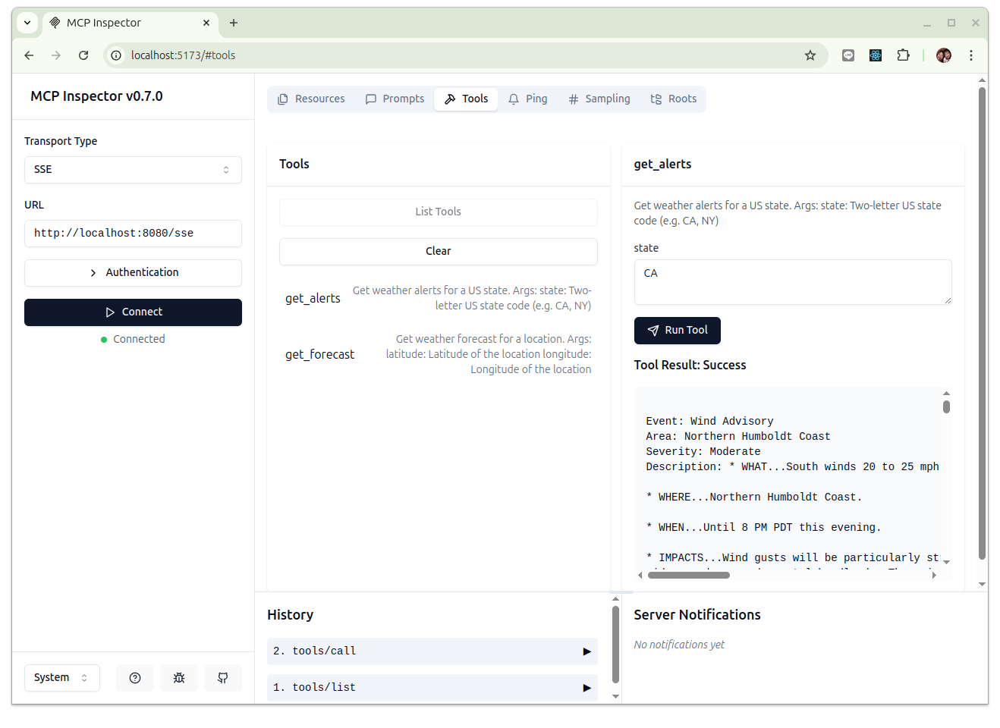

# mcp-weather

一個給 AI Agent 使用的 MCP Server 範例，用來取得美國各州的天氣預報與警示資訊。

- 原始專案: [mcp-sse](https://github.com/sidharthrajaram/mcp-sse)

## 目的

這個 mcp server 示範了基於 SSE 的 MCP 伺服器和使用其中工具的獨立 MCP 用戶端的工作模式。

## 運行環境

本專案使用 [uv](https://docs.astral.sh/uv/) 來管理相關的依賴與 python 的運行環境, 如果尚未安裝 uv 可依照官網的安裝指示來安裝。

接下來的相關命令都是在 Ubuntu 24.04 的環境下執行的, 其它作業系統的操作請自行修改:

```bash
$ curl -LsSf https://astral.sh/uv/install.sh | sh
```

下載源碼:

```
$ git clone https://github.com/erhwenkuo/mcp-weather.git

$ cd mcp-weather

$ uv sync
```

## 運行服務

使用 uv 來啟動:

```bash
$ uv run server

INFO:     Started server process [15784]
INFO:     Waiting for application startup.
INFO:     Application startup complete.
INFO:     Uvicorn running on http://0.0.0.0:8080 (Press CTRL+C to quit)
```

## 驗證結果

首先安裝 nodejs:

```bash
# Download and install nvm:
curl -o- https://raw.githubusercontent.com/nvm-sh/nvm/v0.40.2/install.sh | bash

# in lieu of restarting the shell
\. "$HOME/.nvm/nvm.sh"

# Download and install Node.js:
nvm install 22

# Verify the Node.js version:
node -v # Should print "v22.14.0".
nvm current # Should print "v22.14.0".

# Verify npm version:
npm -v # Should print "10.9.2".
```

接著啟動 [mcp inspector](https://github.com/modelcontextprotocol/inspector):

```bash
$ npx @modelcontextprotocol/inspector

Starting MCP inspector...
Proxy server listening on port 3000

🔍 MCP Inspector is up and running at http://localhost:5173 🚀
```

使用瀏覽器打開 `http://localhost:5173`, 然後進行下列的動作:

1. 在 Transport Type 選擇 `SSE`
2. 在 URL 鍵入 mcp server 的位址與端口, `http://localhost:8080/sse`
3. 點擊 `Connect`, 如果有看到狀態是 "Connected" 代表己經成功連線到 mcp-weather 服務了
4. 點擊上方的 "Tools" Tab
5. 點擊 "List Tools" 按鈕之後會看到有兩個工具:
    - `get_alerts`
    - `get_forecast`
6. 點擊 `get_alerts` 之後在右側會出現這個工具的說明與參數, 在 `state` 的輸入欄中鍵入 "CA" (或是美國其它的州名), 然後點擊 "Run Tool" 按鈕

效果如下圖所示:



## 為什麼使用 SSE

這意味著 MCP 伺服器可以是某個運行在遠端的進程服務，AI Agent（客戶端）可以隨時隨地連接、使用和斷開連接。換句話說，基於 SSE 的伺服器和客戶端可以是解耦的進程（甚至可能在解耦的節點上）。

與客戶端本身將伺服器作為子進程生成的基於 STDIO 的模式相比，這是不同的，並且更適合「雲端原生」用例。

### MCP Server

`server.py` 是 SSE-based MCP server, 預設情況下，伺服器運行在 `0.0.0.0:8080` 上運行，但可以使用命令列參數進行配置，例如：

```bash
uv run server.py --host <your host> --port <your port>
```